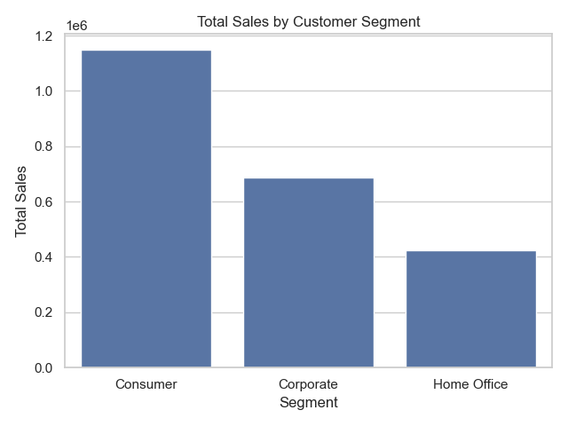
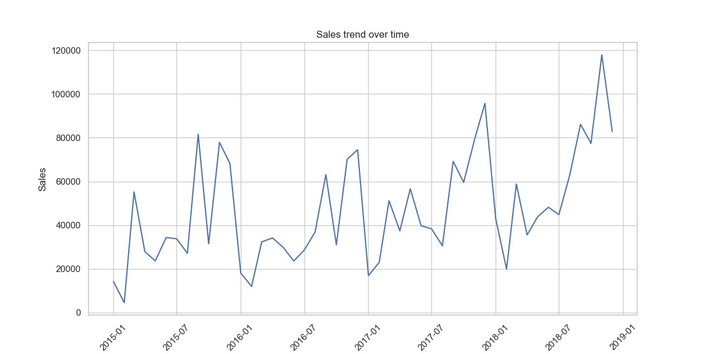

# 📊 Superstore Sales EDA Project

This project is a complete Exploratory Data Analysis (EDA) of the Superstore Sales dataset.  
It demonstrates the ability to clean, transform, visualize, and interpret data using **Python**, **pandas**, and **Seaborn**.

---

## 🎯 Project Objectives

- Explore the structure of a real-world retail dataset
- Clean and prepare data for analysis
- Visualize key metrics: segment, category, and monthly sales
- Derive actionable insights that support business decisions

---

## 📁 Dataset

- **Source**: [Kaggle - Superstore Sales Dataset](https://www.kaggle.com/datasets/surajjha101/stores-area-and-sales-data)
- **File used**: `train.csv`
- **Shape**: ~9800 rows × 18 columns
- **Content**: Orders, customers, products, sales, shipping dates, and more

---

## 🧰 Tools & Libraries

- `Python 3.12`
- `pandas` — data manipulation
- `matplotlib`, `seaborn` — visualizations
- `Jupyter Notebook`

---

## 🧼 Data Preparation

- Removed rows with missing postal codes
- Checked and confirmed no duplicates
- Converted date columns (`Order Date`, `Ship Date`) to datetime format
- Created new features:
  - `Month` — for time series analysis
  - `Delivery Time (Days)` — shipping performance metric

---

## 📊 Visualizations

### 🧍 Segment Sales

### 🪑 Category Sales

### 📈 Monthly Sales Trend

---

## 🔍 Key Insights

- 🔹 **Consumer segment** generated the most revenue
- 🔹 **Technology** was the top-selling category
- 🔹 **Sales peaked in December**, indicating seasonal buying patterns
- 🔹 Shipping typically takes 2–4 days; a few late deliveries noted

---

## 📌 Conclusion

Through this exploratory data analysis of the Superstore Sales dataset, we uncovered several key business insights:

Customer Segment Insights
The Consumer segment brings in the highest total sales overall.
However, the Corporate segment often shows higher average sales per order, suggesting more profitable transactions per customer.
Targeted marketing efforts toward Corporate clients could yield high-value sales.
Category & Sub-Category Analysis
Technology products generate the most revenue, especially in sub-categories like Phones and Accessories.
Office Supplies and Furniture underperform by comparison, with sub-categories like Binders or Bookcases contributing the least.
The company could consider optimizing inventory or promotional efforts on these weaker categories.
Monthly Sales Trends
Sales spike during the end of the year, especially November and December — likely due to seasonal promotions.
This seasonal pattern suggests strong opportunities for holiday campaigns or Black Friday strategies.
Shipping Time & Performance
The average shipping time is within 2–4 days, but some delays occur in specific regions.
Streamlining logistics for underperforming regions could improve customer satisfaction and retention.

---

## 📈 Business Recommendations
Focus high-value offers and B2B strategies on Corporate clients.
Reduce inventory or discount slow-moving sub-categories (e.g., Bookcases).
Scale promotions for Tech products during seasonal peaks.
Analyze logistics by region to address shipping inconsistencies.
