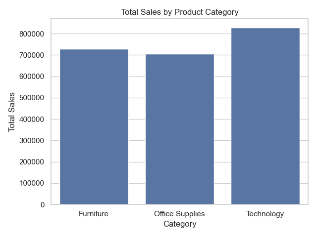
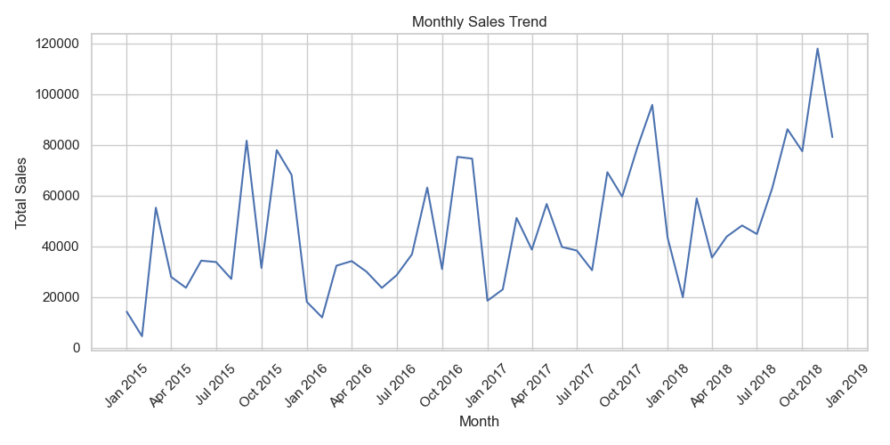

# 📊 Superstore Sales EDA

This project presents a clean and focused exploratory data analysis (EDA) of the Superstore Sales dataset.  
The goal is to derive business insights from customer, product, and time-based sales metrics using Python tools.

---

## 🎯 Objectives

- Identify which customer segments generate the most revenue
- Analyze product category performance
- Uncover monthly sales trends
- Support strategic business decisions with data-driven insights

---

---

## 📌 Key Insights

- The **Consumer** segment contributes the most to total sales.
- The **Corporate** segment has higher average order values, suggesting strong potential for targeted campaigns.
- **Technology** is the highest-performing category, especially sub-categories like **Phones** and **Accessories**.
- **Office Supplies** and **Furniture** underperform — items like **Binders** and **Bookcases** show low contribution.
- **Sales spike in November and December**, likely due to Black Friday and year-end promotions.

---

## 📊 Visualizations

## 📊 Visualizations

| Analysis              | Graph                                |
|-----------------------|--------------------------------------|
| Sales by Segment      |  |
| Sales by Category     |  |
| Monthly Sales Trend   |  |

---

## 🛠️ Tools & Technologies

- `pandas` — for data manipulation
- `matplotlib` & `seaborn` — for visualizations
- `Jupyter Notebook` — for interactive analysis

---

## ✅ Author Notes

It was developed as a complete standalone EDA, focused on clarity, professionalism, and real-world business insights.

